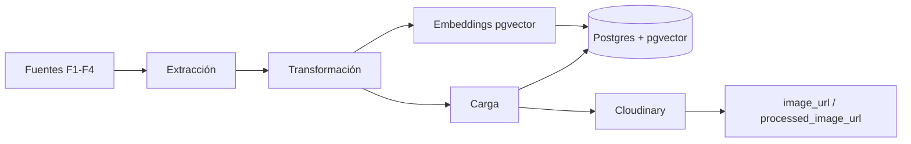

# Pipeline de ingesta de datos v0

**Estado:** diseño documentado. La ingesta automatizada de producción no existe todavía; lo que
existe son extracciones puntuales desde los notebooks y un seed del catálogo cápsula.

- **Tarea:** `86e2xeb7j` — Diseñar pipeline de ingesta de datos v0
- **Fecha:** 2026-10-05
- **Alcance:** Bulk de catálogo y catálogo cápsula. La ingesta de prendas de usuario no se
  cubre aquí: es parte de `backend/garment-analysis-service` y llega por `POST /garments/upload`.

---

## 1. Fuentes

| # | Fuente | Acceso | Formato | Estado |
| --- | --- | --- | --- | --- |
| F1 | `ArtmeScienceLab/Garments2Look` (Hugging Face, `repo_type="dataset"`) | `hf_hub_download` | 4 JSON de metadata | En uso |
| F2 | Imágenes del mismo dataset | streaming HTTP | `polyvore/images.tar.gz` | En uso |
| F3 | Imágenes de muestra del repo | sistema de archivos | `sample_data/*.jpg` | En uso |
| F4 | Dataset curado de estéticas | descarga manual | JPG sueltos | **No existe** |

### F1 — Metadata del dataset

Cuatro archivos JSON, descargados por nombre:

```
mytheresa_image_v1.0_2512.json
polyvore_image_v1.0_2512.json
mytheresa_outfit_v1.0_2512.json
polyvore_outfit_v1.0_2512.json
```

Los de `image` son los que indexan por `garment_id`; los de `outfit` traen el agrupamiento de
prendas en Tenlooks. Se cargan en un único diccionario `catalogo` indexado por id.

Si el dataset está *gated*, hace falta `huggingface_hub.login()` antes. Sin sesión, la descarga
falla con un error de autorización que no es obvio de leer.

**Verificación en runtime:** el catálogo tiene que superar las 100.000 entradas. Un JSON que
carga con menos significa descarga parcial o formato cambiado, y hay que fallar en voz alta en
lugar de seguir con un catálogo truncado.

### F2 — Imágenes

`polyvore/images.tar.gz` son varios GB comprimidos. **No se descarga completo.** Se abre
`tarfile` en modo streaming (`r|*`) sobre el `response.raw` y se corta en cuanto se acumula la
cantidad necesaria, cerrando el stream explícitamente. Sin ese `close()`, la descarga sigue
corriendo en segundo plano y consume el ancho de banda del resto de la sesión.

### F3 — Muestras del repo

`sample_data/usuario_apose.jpg` está versionado en `main`. Las imágenes de prenda de ejemplo que
se usan para desarrollo local (`prenda_camiseta.jpg`, `prenda_chaqueta.jpg`, `prenda_pantalon.jpg`)
vienen del entorno local y no se versionan.

### F4 — Dataset curado de estéticas — pendiente

`docs/context/plan-base.md` §5.2 y el apartado de *fine-tuning extremo* definiton 1.500 imágenes
curadas (300 por cada estética objetivo), descargadas de Unsplash/Pexels frente a
Fashion-Genius/Polyvore, por licencia de uso. **Este dataset no existe todavía** y es el
prerrequisito del fine-tuning y del fallback ResNet-50.

---

## 2. Flujo



- **Extracción** — `hf_hub_download` para metadata, `tarfile` streaming para imágenes, copia local
  para las muestras del repo. Ningún paso persiste el tar completo.
- **Transformación** — rembg + normalización 224×224 (sección 3).
- **Carga** — filas en `Garment` con `user_id = NULL` para el catálogo, y con `user_id` propio
  para prendas de usuario. Imágenes en Cloudinary; la base guarda las URLs, no los bytes.

---

## 3. Transformaciones

El orden importa y está fijado por `openspec/specs/backend/garment-analysis-service/spec.md`:

1. **`rembg` (U-2-Net)** quita el fondo de la imagen. La imagen resultante es la que se persiste
   como `processed_image_url` y la que recibe el clasificador.
2. **Normalización a 224×224 RGB** con las medias y desviaciones estándar de ImageNet/CLIP. Aplica
   igual para CLIP y para el fallback ResNet-50: los dos modelos comparten esa entrada.
3. **Clasificación** — CLIP zero-shot como clasificador primario. Si la confianza sale por debajo
   del umbral configurado, se invoca el ResNet-50 fine-tuned y su resultado reemplaza al de CLIP.
4. **Embeddings** — vector de compatibilidad de 128 dimensiones, guardado en la columna
   `compatibility_embedding` de tipo `vector` (pgvector).

Los cuatro pasos están especificados; ninguno está implementado.

---

## 4. Carga

**Catálogo cápsula.** 50 prendas con `user_id = NULL`, distribuidas sobre la grilla completa de
posiciones × estéticas:

| Dimensión | Valores |
| --- | --- |
| Posición (4) | `top`, `bottom`, `footwear`, `outerwear` |
| Estética (5) | `Old Money`, `Streetwear`, `Soft Boy`, `Starboy`, `Gorpcore` |
| Embedding | 128 dimensiones |

La categoría se normaliza con el prefijo `clothing::` — por ejemplo `clothing::top`.

**Imágenes.** Se sube a Cloudinary y la base guarda `image_url` (original) y
`processed_image_url` (sin fondo). Los bytes no entran al repositorio: el CSP de
`next.config.js` acota `img-src` a Cloudinary justamente para que el cliente no cargue desde
un host arbitrario.

**Regla para datasets derivados.** Cuando un dataset se genera a partir de otro que ya vive en
Hugging Face, se versiona la **referencia** al archivo fuente, no una copia local. Copiar miles
de imágenes al repositorio lo infla y lo vuelve frágil; lo que hace falta para reproducir una
carga es el id del dataset y la ruta dentro de él.

---

## 5. Frecuencia

Batch bajo demanda. No hay cron ni scheduler: la ingesta se dispara cuando alguien la pide
explícitamente. Es aceptable mientras el catálogo cambie pocas veces al mes.

Cuando el volumen lo justifique, la ejecución periódica se define junto con
`bcfp` — *Data Versioning & Lineage* (Sprint 6), que es donde tiene que vivir el versionado de
snapshots y la trazabilidad de qué versión del catálogo está sirviendo el sistema.

---

## 6. Validaciones de calidad

| # | Validación | Umbral | Dónde vive | Estado |
| --- | --- | --- | --- | --- |
| V1 | Cobertura posición × estética | las 4 y las 5 presentes | `verify_coverage()` del seed del catálogo | Implementada |
| V2 | Metadatos completos | `name` y `type` no vacíos | filtro del notebook 03 | Implementada (notebook) |
| V3 | Tamaño del catálogo | > 100.000 entradas | aserción del notebook 03 | Implementada (notebook) |
| V4 | Categorías distintas en la muestra de evaluación | ≥ 2 | notebook 03 | Implementada (notebook) |
| V5 | Integridad referencial de la cápsula | N usuarios comparten 1 `Garment` | test de ownership de dominio | Implementada |
| V6 | Duplicados por hash de imagen | 0 | — | **Pendiente** |
| V7 | Imágenes decodificables | 100% abren con PIL | — | **Pendiente** |

V1 aborta con `exit 1` y rollback en vez de dejar el catálogo a medias. Ese es el criterio que
deberían seguir las demás: una ingesta que deja datos incompletos es peor que una ingesta que
falla.

---

## 7. Estado real

| Pieza | Estado |
| --- | --- |
| Extracción de metadata (F1) | En uso en los notebooks 01-03 |
| Streaming de imágenes (F2) | En uso en el notebook 03 |
| Seed del catálogo cápsula | Implementado y testeado (rama `feat/backend-domain`) |
| Transformaciones (sección 3) | **No implementadas** — backend sin servicio |
| Carga a producción | **No existe** — sin `api-gateway` no hay endpoint de ingesta |
| Dataset curado de estéticas (F4) | **No existe** |
| V6, V7 | **Pendientes** |

La pieza que bloquea el resto es `backend/garment-analysis-service`: hasta que exista, la ingesta
se detiene en un diccionario en memoria dentro de un notebook.
